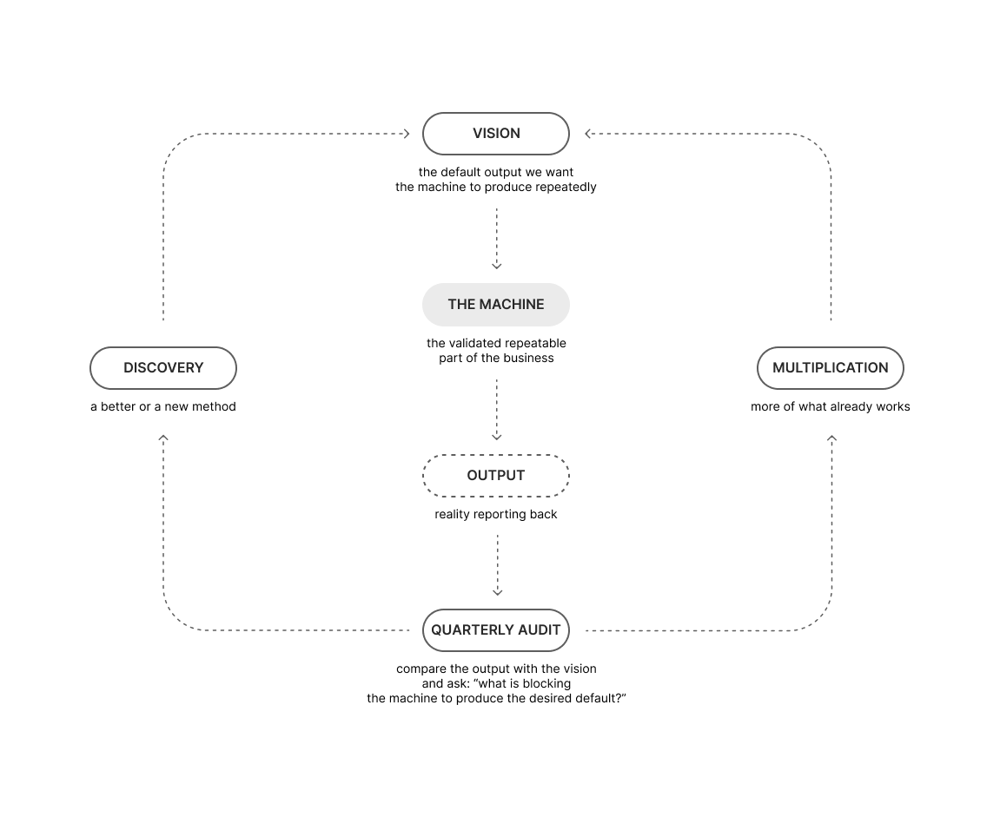

# 1. The Loop

### Apollo, and the Difference Between a Result and a Cause

---

### 1

In 2013, a group of engineers at NASA's Marshall Space Flight Center went looking for an engine.

The engine was the F-1, the enormous first-stage motor, five of which lifted every Saturn V off the pad. They found one sitting in storage. They found another in the Smithsonian, on display, with members of the public walking past it on their way to the gift shop. The engineers took a gas generator out of the first and a gas generator out of the second, pulled the components apart on a bench, and ran a structured-light 3D scanner over the pieces to produce drawings.

That is how the most advanced engineering organization in the history of our species got back to its own design. It went to a museum and measured it.

To understand how strange that is, you have to hold the original scale in your head, and the original scale is almost impossible to hold. At its peak, Apollo employed something like four hundred and ten thousand people, spread across roughly twenty thousand companies and universities. In 1966 — three years before anybody landed — NASA was consuming 4.4 percent of the entire federal budget of the United States. Not of the science budget. Of everything the country spent. The total bill came to around $25.8 billion in the money of the day, somewhere north of $300 billion now.

An effort of that size does not evaporate. Something has to remove it. And something did. Apollo 18, 19 and 20 were cancelled, the Saturn V production line was shut down, and the tooling was scrapped. The four hundred thousand went off into other industries and eventually into retirement, and what they knew went with them.

The usual way to tell this part is as a story about budgets and politics. Congress lost interest. Vietnam. The public got bored of moonwalks and went back to watching television. All of that is true, and all of it is beside the point, because it lets you believe the ending was imposed from outside by people with no imagination.

It was not. The ending was in the sentence at the beginning.

On 25 May 1961, John F. Kennedy stood in front of a joint session of Congress and said that the United States should commit itself, before the decade was out, to landing a man on the moon and returning him safely to the earth. It is probably the most famous vision statement ever delivered, and it has everything the textbooks say a vision should have. A specific outcome. A hard deadline. Enormous emotional force. A scale that made grown engineers weep.

It also worked, which is the part that makes it dangerous. Eight years and two months later, Neil Armstrong stepped off a ladder onto the surface of another world, and roughly a fifth of every human being alive watched him do it.

But read that sentence again as what it actually was, which is an engineering specification. It does not ask for the ability to go to the moon. It asks for a man on the moon, and back, by a date. Everything downstream obeyed it perfectly. Cost, sustainability, the health of the people, the future of the organization — all of it was subordinated to one result on one calendar. The programme was not badly built. It was built exactly to spec, and the spec had a finish line in it.

Six landings. Twelve men on the surface, between July 1969 and December 1972.

And then nobody, for over half a century.

---

### 2

I love this story and I have no interest in being cheap with it. Apollo is one of the most extraordinary things human beings have ever done. The people who did it were magnificent, and the ones still alive have earned every gram of the pride they carry. Nothing here argues that it should not have been attempted.

The price was also real in a way that is easy to state and hard to feel. Four hundred and ten thousand people gave the best years of their working lives to it. And on 27 January 1967, during a routine test on the ground, a fire tore through the sealed cabin of Apollo 1 and killed Gus Grissom, Ed White and Roger Chaffee in under half a minute. The programme absorbed the deaths, rebuilt the capsule, and made the date.

The interesting question about a price like that is not whether it was heavy. It is what it bought.

So here is the entire physical yield of four hundred and ten thousand people, three hundred billion dollars, and three men dead on a test rig in Florida.

Three hundred and eighty-two kilograms.

That is the mass of rock, soil and dust the six landings brought home from six sites — around two thousand two hundred separate samples. Fifty years later, that material plus a handful of robotic missions is essentially the entire physical ground truth humanity possesses about another world. Everything we believe about the age of the solar system, about how planets form, about what happened to the early Earth, is argued over on the basis of 382 kilograms collected during six visits by twelve men across three and a half years.

And the collecting stopped, not because we had learned what there was to learn, but because the thing we had built was not capable of continuing.

The people who paid did not get anything durable back either. They were handed a moment they will never stop being proud of, and they are right to be proud of it. They were not handed an industry. Not one of those four hundred thousand got to leave their children a world with a road to the moon in it.

Meanwhile, NASA's own Inspector General puts the cost of Artemis — the campaign to go back — at around $93 billion between 2012 and 2025, with roughly $4.1 billion for every launch of the rocket that will carry the crew. We are spending tens of billions to reacquire a capability we already had and threw away, and the men who built the first one are being buried while we do it.

Now run the counterfactual, because it is the whole point of this chapter.

Suppose that in 1961 the sentence had been different. Suppose it had been: *build a machine that can put people on the moon and bring them home, four times a year, indefinitely.*

That is a far worse speech. It has no finish line. It cannot be photographed. It would not have beaten the Soviet Union to anything in particular, which means the political appetite that paid for Apollo might never have appeared and the whole thing might have died in a committee room. I am not pretending the choice was obvious or free.

But follow it anyway, because it forces a completely different set of questions in the first week. Not *how do we get there once*, but *what does it cost to move a kilogram, and how do we make that number fall every year*. Not *how do we survive three days on the surface*, but *how do people live there*. Not *how do we build a rocket*, but *how do we build a production line for rockets*. It would have been slower. The first landing might have come in 1975 instead of 1969, and there would have been far less in it for anybody's ego, national or personal.

And by 1990 there is a permanent presence on the moon. By now there is a base, four decades of continuous data, a generation that grew up with people living off Earth as an ordinary fact, direct answers to most of the questions we are currently spending $93 billion to go and ask again, and a cost per kilogram to orbit that has been falling for fifty years instead of standing still for forty.

We chose a moment. We got the moment, gloriously. We have been paying for it ever since.

Which brings me to the sentence this entire book is built on. I want to put it down before I have earned it, so you can hold it while I do.

> **The things that change the world do not happen once.**

Karl Benz built a working automobile in 1886, and for roughly thirty years it changed almost nothing for almost anybody. The car belonged to people who were already rich. The invention existed, was demonstrated, was admired, and did not matter.

What mattered was the moving assembly line — the machine that made cars ordinary. It cut the time to assemble one from around twelve hours to roughly ninety minutes and pushed the price down until the man building the car could afford to own the car. Nobody built a single automobile, confirmed that it worked, and went to bed satisfied that humanity had been improved. The improvement *was* the repetition. It always is.

---

### 3

I am opening a business book with a rocket because almost every company I have ever worked with is built on the Apollo model, and almost none of them know it.

The pattern is exact. Set a result. Attach a date. Subordinate everything to it. Find the people who will not stop, and let them not stop. Absorb the damage — the shortcuts, the departures, the maintenance nobody had time for. Cross the line. Get photographed.

Then discover, six months later, that you cannot do it again, because what you built was a campaign and not a capability.

The record quarter nobody can explain. The launch that worked because four people did not go home for eleven weeks. The client saved by the founder personally, at midnight, for the ninth time. The best year in the company's history, followed by a year that gets blamed on the market.

Founders are proud of exactly the wrong part. They will describe the crossing in enormous detail. They can tell you nothing at all about the boat.

And Apollo at least had the good sense to end. Your company is expected to do it again next quarter, and the quarter after that, forever, with the same people and the same boat.

So look at what the other choice produces.

SpaceX did not set out to reach orbit. Orbit had been reached thousands of times; by the 2000s it was a solved problem. SpaceX set out to make reaching orbit repeatable and cheap, which in practice meant not throwing the rocket away.

Nobody weeps at a reusable first stage. You cannot make a Kennedy speech out of amortization. And for years it looked ridiculous — boosters tipping over on barges, exploding on landing, missing the deck. It looked like an accounting exercise with fireworks.

In December 2015, a Falcon 9 first stage landed upright. Then it happened again. Then it was routine, then boring, then invisible. In 2020, SpaceX flew 25 orbital launches. Then 31. Then 61. Then 96. In 2024, 134 — more than half of all orbital launches on the planet, by anybody. In 2025, 165. A single booster has flown more than twenty times.

Now something I would rather not have to say. I am not an admirer of Elon Musk. A good deal of how he operates, and much of what he says, sits somewhere I am not willing to stand. But this book is not about character, and I am not going to pretend that a man whose values I do not share failed to build the more useful thing. What SpaceX built is more correct, and more genuinely in the service of humanity, than a single victory constructed to feed an ego — and that is true whether the ego belongs to one man or to a superpower. Apollo was, among other things, a demonstration aimed at the Soviet Union. It was magnificent and it was also that. Letting your opinion of a person decide what you are permitted to learn is a very expensive way to protect your feelings.

Ask which of those two organizations could put a permanent base on the moon now. It is not close, and it is not a compliment. It is arithmetic.

The difference is not talent and it is not effort. Apollo had more of both, by a wide margin. Apollo owned a magnificent result. SpaceX owns a boring cause.

A result is what happened. A cause is what makes it happen again.

Almost every company manages results, and it is nearly impossible not to: results are visible, countable and emotionally available. So the company looks at the number and decides it should be larger. A target is set, a deadline attached, pressure applied. A discount. A campaign. More calls, faster hiring, longer hours, decisions drifting back toward the founder.

And sometimes the number moves. That is the whole problem. If it never moved, nobody would do it.

But look underneath. The discount raises revenue and destroys margin. Contracts pulled forward make this quarter stronger and next quarter weaker. Three weeks of overtime protect the delivery and consume the energy that would have produced next month's. The founder who rescues the client personally saves the account and leaves the company slightly more dependent on him than it was on Monday.

Which means we have to be careful with the word *better*, because almost everybody uses it to mean *bigger, this quarter*.

> **Better means it repeats — because you own the cause.**

Read that against the summer of 1969. Measured on output, NASA had the greatest quarter any organization has ever had; nothing in recorded history competes. And on the morning Armstrong came down the ladder, NASA was not a better organization than it had been in 1968, because the capacity to do it again was not being built, and within three years it would be gone.

> **A company can have its best quarter and become a worse business.**

That is not a paradox and it is not a warning against ambition. It is the ordinary condition of most growing companies, and it is invisible from the inside precisely because the one instrument everybody is watching moved the right way.

And I want to refuse a version of this argument before it gets attached to me. It is the version where owning the cause is the sober, modest, grown-up choice, and the enormous numbers belong to people willing to burn the house down. That is backwards, and Apollo and SpaceX are the proof of it. Apollo's greatest year was 1969 and its output for the following fifty was zero. SpaceX's unglamorous accounting exercise now flies more than half of everything that leaves this planet, and every year is larger than the one before it.

So the question is not whether you want a bigger number. Of course you do. The question is what would have to exist inside your company for the result you are proudest of to become the result you produce on an ordinary Tuesday, without anybody bleeding for it — and what you would then do with all the intelligence you got back.

That question has an answer, and the answer has a shape. It is the same shape whether you build rockets, sell software, run four restaurants, or want a marriage that does not need rescuing every eighteen months. It is not a list of principles and it is not a philosophy. It is a loop, with a rule at every point on it, and the rules matter more than the parts.

Here it is.

---

### 4

Five stations and two branches. Nothing in it is complicated. Almost all of it is counterintuitive.

The rest of this chapter walks the loop once, at altitude — the philosophy of each piece, not the mechanics. The mechanics take the rest of the book. What matters here is that by the end of the chapter you understand why the arrows point where they point, and why the whole thing has to be a circle rather than a line.

---

### 5

**Station one. The Vision.**

Every business book on earth tells you to start with a vision, so this is the part where you expect me to be conventional. I am not going to be.

I no longer believe in vision as it is normally taught, which is a long-term objective wearing inspirational clothing. *One day we will be the largest. One day we will reach a billion. One day we will change the way the world does this thing.* Those are victories. They sit in the future. And every one of them quietly teaches the same lesson: that the present is a waiting room.

We have already seen the purest example of it. Kennedy's sentence — *land a man on the moon and return him safely to the earth, before this decade is out* — is magnificent, specific, measurable, and a summit. It describes a moment at which somebody gets to stand up and say we did it.

And notice the peculiar property of a vision like that. It gives an organization total clarity right up until the day it is achieved, and none at all afterwards. It said nothing whatsoever about what should be true on an ordinary Tuesday in 1974, which is exactly why nothing was.

The definition I use instead is this:

> **Vision is the description of the default output we want the machine to produce.**

Not a summit. A default. Not what we will achieve once, heroically, with everything we have. What this business should be capable of producing *normally*, without extraordinary intervention, at a defined cadence, when nobody is being a hero.

I call this the Ordinary Great Quarter — or the Ordinary Great Year, depending on how long your business takes to complete one meaningful cycle. Two words are doing work there. *Great*, because it should be genuinely ambitious; this is not a plan for mediocrity. And *ordinary*, because if it requires anyone to perform a miracle, it is not a default, it is a stunt.

A vision written this way sounds strangely unromantic. Here is roughly the shape of one, for a publishing house:

> In an ordinary great year, without extraordinary intervention, our machine normally produces: revenue of €38–42 million; operating profit of €7.5–8.5 million; four international bestsellers; four new bookstores reaching operating standard; one major author signed.

> And we count these as success only when they are produced within the following non-negotiable limits: no more than 100 full-time employees; net debt no greater than one times EBITDA; no single author representing more than 15% of annual gross profit; no title published without passing the editorial quality gate.

Read that again and notice two things.

The first is the ranges. A default output is a range, not a point, because reality has weather in it and a vision that cannot survive an ordinary bad month is not a description of a machine, it is a wish.

The second is the second half — the limits. Those are not decoration. Every company on earth says it values quality, or integrity, or simplicity. Those words mean nothing whatsoever until they have been converted into a boundary that can be checked and that costs you something. *No single author above 15% of gross profit* is what "we are not building a business that can be held hostage" looks like when you finally write it in a form that can be audited. Everything else is a poster.

And here is the test of whether you have written a vision or a slogan. A slogan cannot reject anything. A vision can.

If an opportunity arrives that would add eight million in revenue but requires you to go to 140 employees, and your vision says one hundred, then the vision has just done a job that no motivational sentence has ever done in the history of commerce. It has made a decision.

> **A vision becomes useful on the day it can refuse an attractive opportunity.**

---

### 6

**Station two. The Machine.**

The machine is the predictable part of the business.

Notice what that sentence does not say. It does not say the machine is the company. It is not. The company contains every idea anyone has had, every initiative, every experiment, every opportunity someone is excited about, every meeting, every hunch. The machine is much smaller than that. The machine contains only the parts that have been validated well enough to produce a result repeatedly, on purpose.

Which means there is a border, and things have to earn their way across it.

A sales script that worked once is not in the machine. A product that delighted a handful of customers is not in the machine. A tactic copied from a competitor is not in the machine. And — this is the one that costs founders the most — the founder's conviction is not in the machine, no matter how strong the conviction or how good the founder's track record.

None of those things are worthless. They are just not yet knowledge. They are candidates.

A very small example makes this concrete in a way that abstraction cannot.

Waffle House is a chain of about two thousand roadside diners across the American South, selling eggs, hash browns and coffee twenty-four hours a day, every day of the year, including Christmas. For decades many locations did not have a working lock on the front door, because there had never been an occasion to use one. Nobody has ever queued overnight for a Waffle House opening. It is, by design, one of the least exciting companies in the United States.

It is also used by the Federal Emergency Management Agency as a sensor. After a hurricane makes landfall, one of the things emergency managers look at is whether the local Waffle House is serving a full menu, a limited menu, or nothing at all. The former head of FEMA called it the Waffle House Index. Full menu means power, gas, water, staff who could get to work, and a delivery that arrived. Closed means, in his words, that's really bad — that's where you get to work.

So what is actually in the Waffle House machine? Not the coffee. Not the recipes, particularly. What is in the machine is the answer to a question almost no restaurant company has ever bothered to answer: *what do we serve when the power is out?*

Somebody worked that out. Somebody figured out which items can be produced on a gas grill with no electricity, wrote it down as a named menu, printed it, distributed it, and trained managers to recognize the conditions under which they should switch to it. Somebody decided where generators live and who is authorized to deploy them. Somebody built a team whose job is to travel toward a hurricane and reopen stores.

None of that is a good idea. Good ideas are cheap. All of that is a good idea that was made visible, repeatable, teachable, and assigned to someone — which is the only thing that distinguishes a company that stays open in a hurricane from a company that has a manager who is very resourceful.

And this is the thing about a machine that founders consistently get backwards. They think it is built because people cannot be trusted.

It is not. It is built because people are human.

People have good days and bad days. Energy and exhaustion. Focus and the morning after a bad night with a sick child. No responsible company should require a human being to produce identical quality every single day through willpower alone, and yet that is precisely what most companies quietly require. A recipe means the meal survives a tired cook. A checklist means the handoff survives a divided attention. A defined process means the customer gets looked after even when the most naturally gifted person on the team is on holiday.

> **The system is not an insult to people. It is a mercy.**

It protects the customer, it protects the colleagues, and above all it protects the person doing the work from being held hostage by today's emotional weather.

---

### 7

**Station three. The Output.**

The output is what the machine actually produced. Revenue, margin, cash, retention, delivery time, quality, the number of locations operating at standard — whatever your vision said the default should be, measured against what reality delivered.

And this station has exactly one job, which almost every company gets wrong.

> **Output is evidence. The machine is the asset.**

Output is not a thing you manage. It is a thing you read. The moment you start managing the output directly — pushing it, pressuring it, setting targets against it — you have stopped operating on the cause and started operating on the readout.

Here is what happens when you do.

In the 1990s, Wells Fargo built its entire identity around a genuinely intelligent idea. A customer with one product is barely profitable; a customer with eight is enormously profitable and almost impossible to lose. The chief executive named the target and gave it a slogan that tells you how proud the company was of it: *eight is great.*

For years, the cross-sell ratio was the most watched number in American banking. It appeared in the annual report. Analysts asked about it every quarter. It went up, and up, and Wells Fargo was regarded as the best-run large bank in the country.

Then it was pushed down. Regional targets, branch targets, daily targets. Employees phoning in numbers several times a day. Managers replaced for missing. Bonuses, promotion, and continued employment all running through one figure.

And a branch employee who is two products short at four in the afternoon has a choice. Find two customers in ninety minutes who genuinely need something. Or open an account.

Forensic review later identified up to about three and a half million accounts that may have been unauthorized. Wells Fargo fired approximately 5,300 people. It was fined $185 million. The chief executive resigned. And in January 2017 the bank announced it would stop reporting the number entirely.

Five thousand three hundred people do not independently invent the same fraud. What happened is what always happens when a measure is promoted to a purpose: the measure and the purpose overlap in ordinary conditions — which is exactly why it looked so good for so long — and they come apart completely under pressure.

If you want a purer version of the same thing, go back to Hanoi in 1902.

The French colonial administration had just built a magnificent modern sewer system under the European quarter: nine miles of clean, dark, damp, temperature-stable tunnel with direct access to every French kitchen in the city. Which is to say, the finest rat habitat ever constructed in Southeast Asia. Rats came up through the toilets. Plague was moving across Asia.

So the administration did the sensible, modern, results-oriented thing. It stopped paying sewer workers by the hour and started paying a bounty per rat.

The numbers were magnificent. Seven thousand rats a day. Fourteen thousand. On the record day, over twenty thousand. But collecting and disposing of twenty thousand carcasses at a municipal office in the tropics is its own nightmare, so the administration made an efficiency improvement: don't bring us the rat. Bring us the tail.

Within weeks, French officials began noticing perfectly healthy tailless rats running around Hanoi.

There were rat farms in the suburbs. There was a smuggling network importing rodents into the plague city from across the region, because rats had become a cash crop.

Every step the administration took was defensible. Pay for output rather than time — correct. Require physical proof — correct. Reduce the cost of collecting proof — correct. What nobody did was ask whether the measure and the purpose still pointed the same direction. The purpose was fewer rats. The measure was tails. And the fastest way to produce more tails is to produce more rats.

Both of these are the same failure. The output was treated as the thing to be moved, rather than as the thing to be read.

---

### 8

**Station four. The Audit.**

Once a quarter, the company stops and looks at reality on purpose.

Not a review of activity. Not a report on how hard everyone worked. An audit of the machine, and it asks two questions, in this order.

First: how does the current output compare to the last audit? What improved, what deteriorated, what became unstable, what became normal?

Second, and more important: how far is the machine's current default output from the default output described by the vision?

That second comparison is what separates this from every quarterly review you have sat through. In a normal review, this quarter is compared to last quarter and to a target, and the conversation becomes an argument about whether the target was fair. In this audit, the current output is compared to a description of what the machine should be able to do normally. The gap between them is not a judgment on anyone. It is information about the machine.

And then the audit asks the only question that matters:

> **What is currently blocking this machine from producing the default output in the vision?**

Two things make that question hard to answer honestly.

The first is that most companies try to answer it in a room, from a spreadsheet.

Taiichi Ohno, who built the Toyota Production System, had a training method for this that most Western managers find close to abusive. He would take a young engineer onto the factory floor, draw a circle on the concrete in chalk, tell him to stand in it and watch, and walk away. He would come back hours later — the stories say four, sometimes eight — and ask one question. *What did you see?*

The first answer was always wrong. The engineer would report what he had been trained to report: the line is running, output is roughly on target, there's a small issue at the third station. Ohno would say *look again*, and leave.

The point was not endurance. The point is that the first hour of observation shows you what you already believe, because your head has a model and your eyes go looking for it. Somewhere in the third hour, if you are honest and you have nothing else to do, the model breaks. You notice that the operator walks four steps for a part that could be at his elbow, eleven hundred times a shift. You notice a small stack of components that is always there — never zero — which means something upstream produces faster than something downstream consumes, which is a bottleneck that exists in the physical world and appears in no report anywhere. You notice the little jig the operator made himself out of tape, which is either an improvement nobody captured or a symptom nobody fixed.

None of that is in the data. All of it is in the room. An audit that only reads reports can tell you *that* the output moved. It almost never tells you *why*, because the why is usually a physical fact about how the work actually happens, and physical facts do not survive the trip into a spreadsheet.

The second difficulty is that every company has more problems than it can solve, and most of them are real. If you try to fix all of them you will exhaust the organization and change nothing.

So the audit needs a lens that separates pain from constraint, and the one I use is deliberately uncomfortable:

> **If this machine had to produce twice the output, where would it break first?**

That is not a target. Nobody is being asked to double anything. It is a diagnostic instrument, and its value is that doubling is uncomfortable enough to expose architecture.

Ask a team how to improve revenue by five percent and you will get a list of optimizations: send more emails, nudge prices, push the pipeline, work a bit harder. Ask what would break first if revenue doubled while profit and quality held, and the conversation changes completely. Now they have to look at capacity, at conversion, at cash conversion, at whether onboarding would collapse, at whether the founder is a single point of failure, at whether unit economics get better or worse with scale. They can no longer hide inside activity.

The answer to that question is your bottleneck. And once you have it, the audit asks one final thing, which determines everything that happens for the next ninety days:

> **Can this bottleneck be removed by multiplying something that already works — or does it need something we have not discovered yet?**

Those are the only two answers, and they send you down completely different roads. Different tools, different timescales, different definitions of success, different behaviour from the person leading. Choosing the wrong road is one of the most expensive mistakes available to a company, and it is made constantly, in both directions: reinventing a process when more capacity would have solved it, and scaling a process that was never good enough to deserve a second copy.

---

### 9

**Branch one. Multiplication.**

Often the answer is multiplication — far more often than founders want it to be, because multiplication is the unglamorous road and there is no new idea in it anywhere.

You have a sales team that follows a validated process, produces a predictable range of output, and is at capacity. You do not need a new sales philosophy. You need a second team built from the same blueprint. You have one location with healthy economics, consistent quality, and no permanent need for rescue. You may be able to build another one. You have a customer-success process that retains clients reliably and is overloaded. You need to duplicate the capacity while protecting the standard.

This is multiplication: **using knowledge the company already owns to add productive capacity.**

It sounds like the easy branch. It is the one that destroys more companies.

Because familiarity is not proof of repeatability. A team may succeed because its members have worked together for six years and can finish each other's sentences. One exceptional person may quietly absorb every difficult case. The founder may be filling gaps that nobody has ever named. All of that produces a good result. None of it proves the result belongs to the machine rather than to those particular people.

So multiplication has an entry test, and it is brutally simple:

> **Could a newly recruited and inducted team, following the written blueprint, reproduce the same range of output without the founder or the original team rescuing it?**

If the answer is no, you do not own a transferable process. You own experience trapped inside particular human beings. And what you will multiply is not the machine.

This is where most multiplication goes wrong, and it goes wrong in a very specific way. A company copies everything about the successful unit that it can *see* — the layout, the script, the job titles, the equipment, the brand — and silently drops whatever it could not see, because nobody had ever identified it as a cause. Then it discovers, two years and eleven locations later, that the invisible part was the one doing the work.

> **Multiplication does not make the unit true. It makes the unit louder.**

If the unit is chaotic, you multiply chaos. If it is unprofitable, you multiply loss. If it depends on the founder, you multiply the founder's burden across more locations. And if nobody in the building can specify what exactly is supposed to be repeated, then you are not multiplying a machine at all. You are copying activity and hoping the result follows it.

There is a version of this that happens more slowly and is therefore harder to see. In 2007, Howard Schultz — who had stepped back from running Starbucks — wrote an internal memo about what had happened to the company during its enormous expansion. It leaked, and it remains one of the most honest documents a founder has ever written about his own business.

He went through the decisions of the growth years one at a time. They had installed automatic espresso machines, because the manual machines were slow and inconsistent — and in doing so removed the theatre of a person making your drink, and installed a machine tall enough to block your view of the barista. They had moved to flavour-locked packaging, which kept coffee fresher and made logistics dramatically easier — and removed the smell of coffee from the store. They had standardized store design for efficient rollout, which is exactly what you do when opening thousands of locations — and the stores began, in his phrase, to look like a chain of stores.

Every one of those was a rational optimization of a part. Together they had removed the thing the whole machine existed to produce.

In February 2008, back as chief executive, Schultz closed all 7,100 American stores for three and a half hours in the middle of a business day, in the middle of a recession, to retrain 135,000 baristas. It cost around six million dollars in lost revenue. Dunkin' Donuts ran a promotion during the window.

The three and a half hours were not really about espresso technique. Nobody believes a barista learns a craft in an afternoon. They were the only way Schultz could find to say one thing to two audiences at once. To a hundred and thirty-five thousand employees: the standard is real, and we will burn six million dollars in a recession to prove that we mean it. To everyone else: something here is being taken seriously again.

And he did the unglamorous half as well, which is the part that gets left out. Starbucks closed around six hundred underperforming American stores that year and slowed new openings sharply. It replaced the espresso machines with shorter ones, so you could see the person making your drink. It went back to grinding beans in the store, accepting a slower and messier process, in order to get the smell back.

That is what it costs to repair a unit after you have already multiplied it — closing hundreds of locations, reversing engineering decisions that were individually correct, and shutting down a national business for an afternoon to say something you can no longer say any other way.

Getting the unit right before you copy it is enormously cheaper. Which is the entire reason for the entry test.

> **Multiplication is not the reward for a good result. It is the reward for a result you can specify.**

---

### 10

**Branch two. Discovery.**

And sometimes multiplication is not available at all, because the bottleneck cannot be removed by doing more of what you are already doing. What you are already doing is not good enough to deserve more of it.

The sales team is not producing profitable customers — adding salespeople would multiply a problem. Customers are leaving and nobody knows why — a retention target cannot manufacture the missing explanation. A channel has stopped working and you do not know which new one will acquire customers profitably.

Imagine a gardener who works hard every single day while the garden gets worse. He prunes the fruit trees at the wrong time and cuts off the branches that would have fruited. He waters by habit rather than by checking, feeding the weeds as faithfully as the flowers. He treats every disease with the same spray. He is disciplined. His method is wrong.

The standard response to a deteriorating garden is to demand overtime or hire a second gardener. But three extra hours a day from a man who is cutting flowers and watering weeds will give you fewer flowers and stronger weeds.

> **When the method is unknown, the problem is not performance. The problem is learning.**

And this is where I made the mistake that took me the longest to see, and that cost my clients and me the most.

For most of my career I managed this kind of work with objectives. It felt responsible. Define the result. Attach a deadline. Assign an owner. Create urgency. Push until the team finds a way.

But a target cannot create knowledge the company does not have. If you knew how to produce the result reliably, the method would already be in the machine. When you do not know how, the target creates urgency without creating a cause — and what happens next is worse than nothing. The team takes its best current guess. The guess becomes a plan. The plan becomes a public commitment. And because the commitment is now attached to someone's competence, everyone involved becomes invested in proving the guess right. Weak signals get defended. Contradictory evidence gets explained away. The company changes its operations before it has actually learned anything.

> **We use the pressure of an objective to convert uncertainty into premature commitment.**

The alternative is not to be vague. It is to run experiments — and to accept that discovery is a genuinely different kind of work with a genuinely different contract, in which the deliverable is trustworthy evidence rather than a promised result.

Now, the objection to this is that discovery is chaotic and cannot be scheduled, and therefore has to be left to inspiration. That objection is half right, and the half that is wrong is expensive.

In March 1876, Thomas Edison moved into a white two-storey building in an empty stretch of New Jersey farmland and made a promise that no inventor had ever made. He said he would produce a minor invention every ten days, and a big thing every six months or so.

Read that again, because it should be impossible. You cannot schedule an insight.

What Edison understood — and it is why he was an architect rather than merely a genius — is that while you cannot make any particular discovery predictable, you absolutely can make the *rate* of discovery predictable, if you build a machine for producing attempts.

So look at what he actually built. The ground floor was a full precision machine shop, so a sketch made in the morning could be a physical object by the afternoon without waiting on a supplier. The upper floor was a chemical laboratory and library, stocked with an ambition to hold a sample of every material available, so that no experiment ever had to stop and order something. He staffed it with specialists — a mathematician, a glassblower, machinists, chemists. And he ran the whole thing on documentation: every experiment written up in bound notebooks, with dates and results, including especially the failures. When you have tried sixteen hundred materials for a filament and written down what each one did, you own an asset nobody can buy.

That is what a discovery function looks like when it is designed rather than hoped for.

The modern version is Booking.com, which at any moment is running something like a thousand experiments in parallel and more than twenty-five thousand a year. A developer, a designer, a copywriter, a support agent — any of them can propose a test and get it running without a committee approving the idea first.

To most executives that sounds like anarchy, and the objection is the right one: what happens when somebody tests something that damages the business?

The answer is that what has been handed out is not permission to change the product. It is permission to run a test — and the test lives inside a governed platform that is the real invention here.

The platform decides how much traffic a test may touch, which is often a fraction of a percent of it. It watches a set of guardrail metrics that the person running the test cannot switch off, and it stops the test automatically when one of them moves the wrong way. It records what the experimenter predicted before the test began, so that nobody gets to decide afterwards what the test was really about.

So nothing reaches the operation because somebody was persuasive in a meeting. A test that produces a real, repeated effect becomes a candidate, and then it is deliberately built into the product as a change to the machine, with everything that implies — documentation, training, a standard. A test that produces nothing is switched off and written down, and the company is now more knowledgeable than it was on Monday.

That separation is the whole architecture. Experiments run *beside* the thing that pays the bills, at a scale where being wrong is survivable, and only validated learning is allowed to cross back into it. The cost of a bad idea has been engineered down to almost nothing, which is precisely why permission to have one can be given to everybody.

And then there is the number that nobody outside that world quite believes. Roughly nine out of ten ideas do not work. Generated by experienced people, on a site they know intimately, with more data than any competitor on earth. Nine out of ten.

Sit with what that implies. If nine out of ten expert intuitions are wrong, then a company that decides by seniority — where the most experienced person in the room chooses and the choice is implemented everywhere — is rolling out wrong answers most of the time and calling the result strategy. And it will never find out, because once you have changed everything you have no comparison left.

---

### 11

Both branches end at the same place, and there is a rule about how they get there.

Discovery introduces unvalidated change. Multiplication introduces people and capacity that have not yet demonstrated they can perform at standard. If either one is pushed directly into the working operation, the machine, you damage the predictability you were trying to improve.

So the governing rule of the whole system is three words:

> **Protect the machine.**

Discovery happens *beside* the machine, not inside it. A restaurant does not test a new dish by letting every chef improvise during dinner service. It tests the dish separately — ingredients, method, taste, cost, consistency, customer response — and only when the recipe works does it get documented, trained, standardized, and put on the menu. Creativity belongs before the standard. Reliable execution belongs inside it.

Multiplication is built beside the machine too. You do not pour new people into a functioning team and expect them to absorb its unwritten knowledge by osmosis. You extract the unit, recruit into it, induct, train, and test it separately, and you merge the new capacity only when it can hold the standard without degrading the original operation.

A positive experiment is not permission to change the machine. A promising duplicate is not permission to merge.

> **Build beside the machine. Validate. Then merge.**

Now look at the diagram again, and at the one thing in it that surprises almost everybody.

The two branches do not point back at the machine. They point back at the vision.

That is deliberate, and it is the part of this system that took me longest to understand. When an experiment succeeds, or when a duplicated unit finally holds the standard, you have produced two different things and they are easy to confuse.

The first is a method, or a piece of capacity. That does eventually belong inside the machine, and it gets there exactly the way this section has described — built beside, validated, merged.

The second is information about what this business is now capable of. And that does not belong in the machine at all. It belongs in the vision.

Because you wrote the vision using what you knew at the time, and what you knew at the time is precisely what the experiment has just changed.

You discover a way of acquiring customers at half the cost you had assumed was structural. That does not simply make this quarter better. It means the profit range in your vision was written against an old constraint that no longer exists, and leaving it there is now a failure of ambition.

Or you multiply a unit and find that the economics quietly degrade at the fourth location, for reasons nobody could have predicted from the first three. That is not only an operational problem. It means the number of locations in your vision was a guess, and you now have evidence, and the honest thing to do is change the document.

This is what stops a vision from turning into a framed piece of paper that everybody has stopped reading. It is not revised because somebody got excited in a meeting. It is revised because the company learned something and can point at what it learned.

> **The machine is updated by validated methods. The vision is updated by validated knowledge. Both come from the same two branches, and confusing them is how companies end up with either a stale ambition or an unstable operation.**

And here is the part that founders find hardest to accept, because it sounds like caution and it is actually the opposite.

Protecting the machine does not freeze the company. It is what makes intelligent change affordable. Because the machine's predictable output is what generates the cash that funds the experiments, the time and attention that good people need in order to think, the customer trust that makes controlled pilots possible, and the stable baseline against which you can even tell whether a change helped.

A company that is fighting for survival every week cannot afford to wait for better evidence, cannot afford to absorb a negative result, and cannot afford to protect people while they learn. Every experiment becomes an existential bet, and existential bets are decided by conviction rather than evidence.

> **The machine pays for the laboratory. Damage the machine in the name of growth and you have damaged the thing that finances growth.**

---

### 12

Now stand back and look at the loop again.

Vision describes the default output. The machine produces it. The output reports what actually happened. The audit compares that reality to the vision and asks what is in the way. Multiplication and discovery remove the obstacle — one using knowledge the company already owns, the other creating knowledge it does not yet have. Both are built beside the operation and validated before anything crosses back in.

And then the loop closes where nobody expects it to close. Not at the machine, but at the vision — because by the time you have learned something, the description of what normal should look like is out of date. You rewrite it, and the new vision reshapes the machine, and the machine produces a better output, and the audit measures a smaller gap.

That is the whole engine. It has no finish line in it anywhere, which is exactly the point.

There is one property of this system that I want to name explicitly before we go any further, because it is the reason the next chapter exists.

Nowhere in that loop does the ordinary result depend on somebody being exceptional.

Read that sentence carefully, because it is not the same as saying there is no place for exceptional people, and the difference between those two statements is the subject of the next chapter.

At every station of the loop, work that used to require a remarkable human being has been given to something else. The vision does the refusing that a founder's willpower used to do. The machine does the remembering that a senior employee's head used to do. The output does the reporting that used to be done by whoever had the best story. The audit does the diagnosing that used to require somebody's intuition. None of that is a demotion. It is what allows a Tuesday to be a Tuesday.

And then there is discovery, which is unlike every other station.

Discovery is the one place in the loop where the answer is genuinely not known, where the path cannot be specified in advance, and where the ability to operate without a map — to make decisions on incomplete information, to stay functional in the dark, to see a possibility nobody else has seen — is not a pleasant extra. It is the entire job.

That capacity is rare, and it is one of the most valuable things a person can bring to a company. Nothing in this book is an argument for getting rid of it. The argument is about where it is allowed to operate — in the laboratory, where its unpredictability is an asset, rather than in the middle of an operation that is supposed to run without rescue.

That is a clean enough distinction on paper. In practice it is the hardest thing a founder ever does, because it is not really a question about organizational design. It is a question about who you have decided to be at work, and I had to answer it about myself before I could build any of this.

If the system no longer needs somebody to save it — what happens to the person whose entire sense of value came from being the one who does?

For most of my life, that person was me.

---

*Next: two men set out for the same piece of ice in October 1911.*
